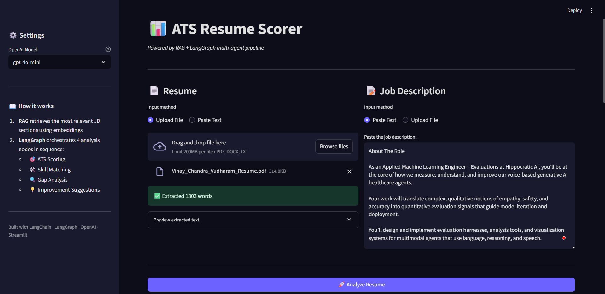
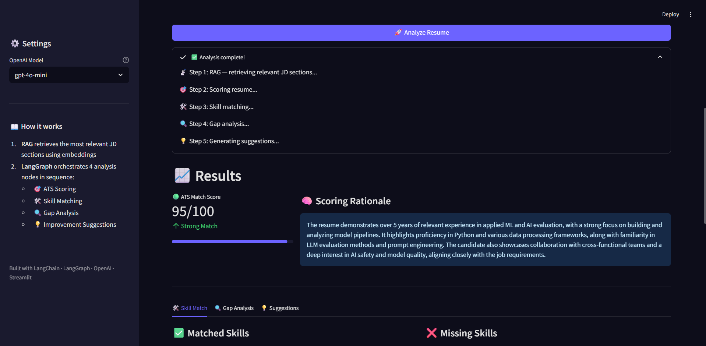
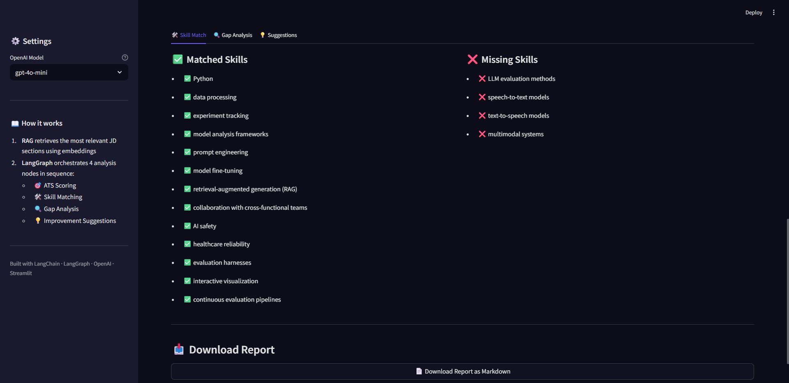
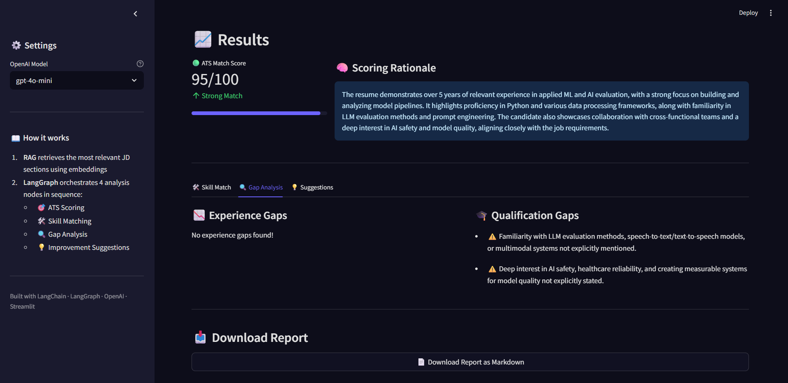
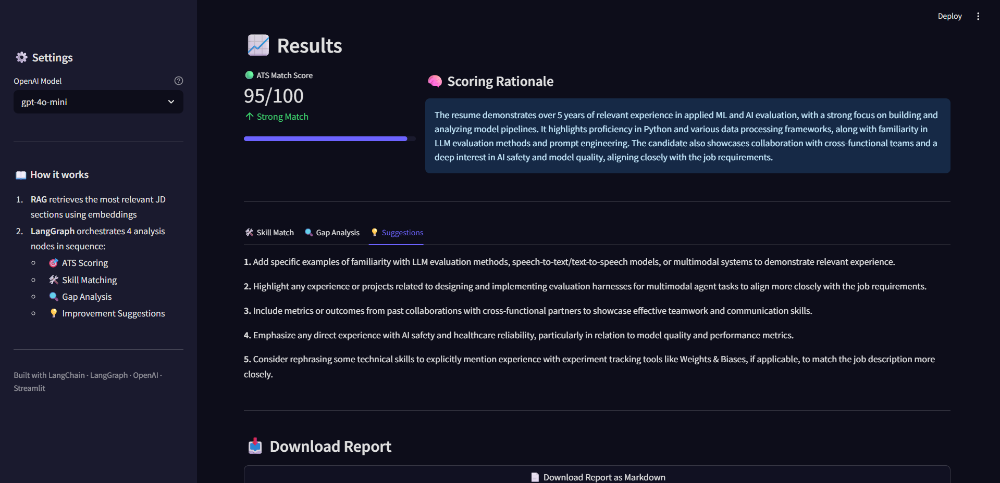

# 🎯 ATS Resume Scanner

> **AI-powered resume analysis system** that scores your resume against job descriptions using RAG, LangGraph, and OpenAI — giving you actionable insights to land more interviews.

---

## 🖥️ Demo

### Upload Resume & Job Description


### ATS Score & Rationale


### Skill Match


### Gap Analysis


### Improvement Suggestions


---
## 📌 What is ATS Resume Scanner?

**ATS Resume Scanner** is a production-grade, multi-agent AI pipeline that evaluates how well your resume matches a job description — exactly the way real Applicant Tracking Systems (ATS) do.

It goes beyond a simple score. It tells you:
- ✅ Which skills you have that match the JD
- ❌ Which required skills are missing from your resume
- 🔍 Where your experience and qualifications fall short
- 💡 Specific, actionable steps to improve your resume for that exact role

---

## 🏗️ System Architecture

```
┌─────────────────────────────────────────────────────────┐
│                   STREAMLIT FRONTEND                    │
│         Resume Upload / JD Input / Results UI           │
└──────────────────────┬──────────────────────────────────┘
                       │
                       ▼
┌─────────────────────────────────────────────────────────┐
│                  LANGGRAPH PIPELINE                     │
│                                                         │
│  ┌─────────────┐    ┌──────────────┐                   │
│  │  RAG Node   │───▶│ Scoring Node │                   │
│  │             │    │   (0-100)    │                   │
│  │ JD Chunks   │    └──────┬───────┘                   │
│  │   FAISS     │           │                           │
│  │ Embeddings  │    ┌──────▼───────┐                   │
│  └─────────────┘    │ Skill Match  │                   │
│                     │    Node      │                   │
│                     └──────┬───────┘                   │
│                            │                           │
│                     ┌──────▼───────┐                   │
│                     │ Gap Analysis │                   │
│                     │    Node      │                   │
│                     └──────┬───────┘                   │
│                            │                           │
│                     ┌──────▼───────┐                   │
│                     │  Suggestions │                   │
│                     │    Node      │                   │
│                     └──────┬───────┘                   │
│                            │                           │
│                     ┌──────▼───────┐                   │
│                     │  Markdown    │                   │
│                     │   Report     │                   │
│                     └─────────────┘                   │
└─────────────────────────────────────────────────────────┘
```

### How each node works

| Node | Role |
|------|------|
| **RAG Retrieval** | Splits JD into chunks → embeds with OpenAI → stores in FAISS → retrieves top-k most relevant sections against your resume |
| **Scoring** | Scores resume 0–100 with a structured JSON reasoning output |
| **Skill Match** | Extracts matched ✅ and missing ❌ skills |
| **Gap Analysis** | Identifies experience and qualification gaps |
| **Suggestions** | Returns 3–5 specific, actionable resume improvement tips |

---

## ✨ Features

- 📎 **Multi-format resume upload** — PDF, DOCX, or TXT
- 🔍 **RAG-powered analysis** — FAISS vector search ensures the LLM focuses on the most relevant JD sections
- 🤖 **LangGraph state machine** — structured multi-node pipeline with typed state
- 🎯 **ATS Score** — 0 to 100 with color-coded verdict (Strong / Moderate / Weak match)
- 🛠️ **Skill Match breakdown** — side-by-side matched vs missing skills
- 🔍 **Gap Analysis** — experience and qualification gaps clearly listed
- 💡 **Improvement Suggestions** — specific, tailored resume advice
- 📥 **Downloadable Markdown report** — save and share your full analysis
- ⚙️ **Model selector** — switch between `gpt-4o-mini`, `gpt-4o`, `gpt-4-turbo`

---

## 🚀 Quick Start

### 1. Clone the repo

```bash
git clone https://github.com/chandra-vv/genai_portfolio.git
cd genai_portfolio/ATS_Resume_Scanner
```

### 2. Create a virtual environment

```bash
python -m venv venv

# Windows
venv\Scripts\activate

# Mac/Linux
source venv/bin/activate
```

### 3. Install dependencies

```bash
pip install -r requirements.txt
```

### 4. Set up your API key

```bash
cp .env.example .env
```

Edit `.env`:
```
OPENAI_API_KEY=sk-proj-your-key-here
```

### 5. Run the app

```bash
streamlit run app.py
```

Open [http://localhost:8501](http://localhost:8501) in your browser.

---

## 📁 Project Structure

```
ATS_Resume_Scanner/
├── app.py                  # Main Streamlit application
├── requirements.txt        # Python dependencies
├── .env.example            # Environment variable template
├── .gitignore              # Ignores .env and cache files
├── .streamlit/
│   └── config.toml         # Streamlit theme configuration
└── README.md               # This file
```

---

## 🛠️ Tech Stack

| Layer | Technology | Purpose |
|-------|-----------|---------|
| **LLM** | OpenAI GPT-4o-mini / GPT-4o | Resume scoring, analysis, suggestions |
| **Orchestration** | LangGraph `StateGraph` | Multi-node agentic pipeline |
| **RAG** | LangChain + FAISS | JD chunk retrieval via embeddings |
| **Embeddings** | OpenAI `text-embedding-ada-002` | Semantic similarity search |
| **UI** | Streamlit | Interactive web interface |
| **File Parsing** | pdfplumber, docx2txt | Extract text from PDF/DOCX |
| **Env Management** | python-dotenv | Secure API key loading |

---

## 📊 Sample Output

```
ATS Score:  78 / 100  🟢 Strong Match

✅ Matched Skills:          ❌ Missing Skills:
  - Python                    - Kubernetes
  - LangChain                 - AWS SageMaker
  - RAG                       - MLflow
  - OpenAI API
  - Streamlit

💡 Suggestions:
  1. Add Kubernetes experience or mention familiarity with container orchestration
  2. Include any AWS cloud projects, even personal ones
  3. Quantify your AI project impact with metrics (e.g., reduced time by X%)
```

---

## ⚙️ Configuration

You can switch the Streamlit theme via `.streamlit/config.toml`:

```toml
[theme]
base = "dark"
primaryColor = "#6C63FF"
backgroundColor = "#0F0F0F"
secondaryBackgroundColor = "#1E1E1E"
textColor = "#FFFFFF"
```

---

## 🔒 Security Notes

- Your `.env` file is **never committed** to GitHub (covered by `.gitignore`)
- Only `.env.example` (with no real key) is pushed
- If deploying to Streamlit Cloud, add your key under **App Settings → Secrets**

---

## 🌐 Deploy on Streamlit Cloud (Free)

1. Push this repo to GitHub
2. Go to [streamlit.io/cloud](https://streamlit.io/cloud) → **New App**
3. Select repo → branch `main` → main file: `ATS_Resume_Scanner/app.py`
4. Under **Advanced Settings → Secrets**, add:
```toml
OPENAI_API_KEY = "sk-proj-xxxx"
```
5. Click **Deploy** — get a shareable public URL 🎉

---

## 🗺️ Roadmap

- [ ] Multi-resume batch scoring
- [ ] Resume rewrite suggestions (auto-edit mode)
- [ ] LinkedIn job description scraper integration
- [ ] Export report as PDF
- [ ] Local LLM support (Ollama / Mistral)

---

## 👨‍💻 Author

**Vinay Chandra**   
🔗 [GitHub](https://github.com/chandra-vv/genai_portfolio) 

---

## 📄 License

This project is open source and available under the [MIT License](LICENSE).
