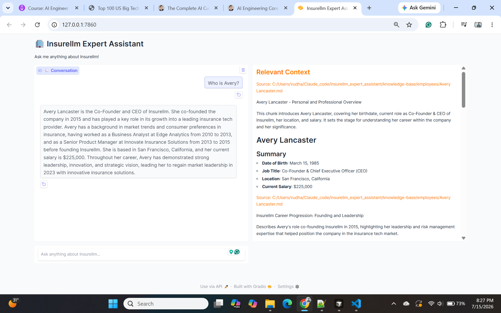
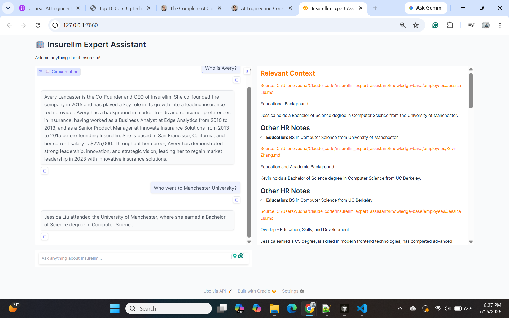
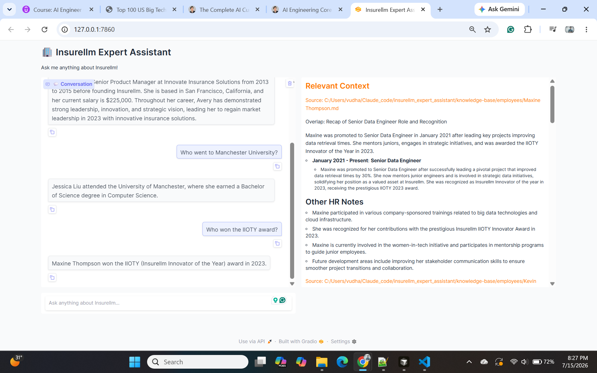
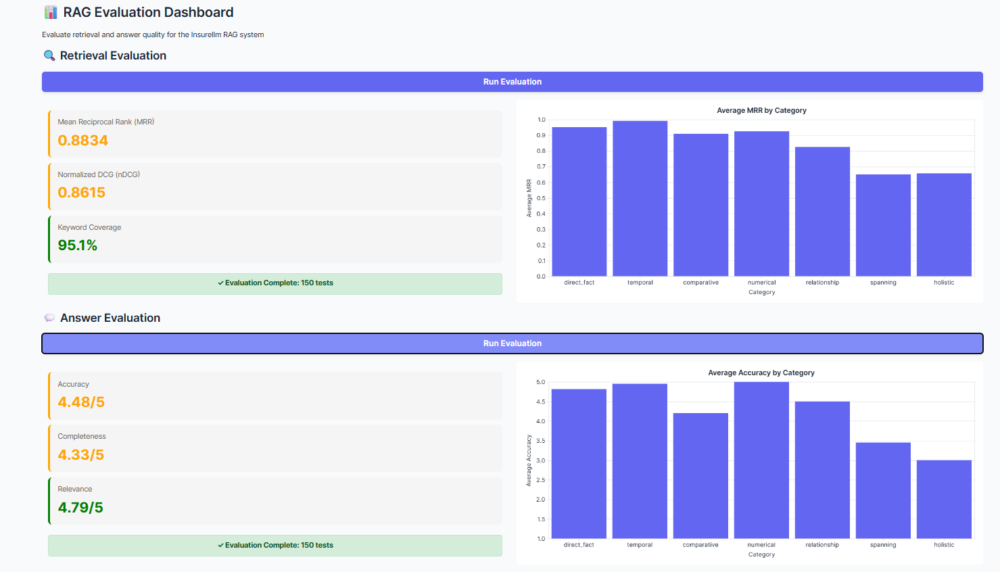

# 🏢 Insurellm Expert Assistant

> **Production-grade RAG assistant** for a fictional insurance-tech company — LLM-based document
> chunking, dual-query retrieval with reranking, and an automated evaluation dashboard scoring
> **4.48/5 answer accuracy** across 150 test questions.

---

## 🖥️ Demo

A real multi-turn conversation, with the retrieved source context shown alongside each answer:

| | |
|---|---|
|  |  |
|  | |

---

## 📌 What is Insurellm Expert Assistant?

**Insurellm Expert Assistant** is a Retrieval-Augmented Generation chatbot that answers questions
about Insurellm — a fictional insurance-tech company — using its internal knowledge base (company
docs, employee records, product info, and client contracts) as grounding context.

It's built as a full RAG system, not just a wrapper around an LLM call:
- 🧩 **LLM-based chunking** — documents are split into overlapping, semantically labeled chunks
  (headline + summary + original text) rather than naive fixed-size splits
- 🔍 **Dual-query retrieval** — each question is searched both as asked and as an LLM-rewritten,
  search-optimized query, then merged
- 📶 **LLM reranking** — retrieved chunks are reordered by relevance before being sent as context
- 📊 **Automated evaluation** — a 150-question test set (7 categories) scores both retrieval
  quality (MRR, nDCG, keyword coverage) and answer quality (LLM-judged accuracy, completeness,
  relevance)

---

## 🏗️ System Architecture

```
┌──────────────────────────────────────────────────────────────────┐
│                         INGESTION (offline)                      │
│                                                                    │
│   knowledge-base/*.md ──▶ LLM Chunking ──▶ text-embedding-3-large │
│                          (gpt-4.1-mini)         │                 │
│                                                  ▼                 │
│                                     Chroma Vector Store            │
│                                     (preprocessed_db/)             │
└──────────────────────────────────────────────────────────────────┘
                                    │
                                    ▼
┌──────────────────────────────────────────────────────────────────┐
│                      ANSWERING (per question)                    │
│                                                                    │
│  Question ──▶ Query Rewrite ──▶ Retrieve (original + rewritten)  │
│                                          │                         │
│                                          ▼                         │
│                              Merge + LLM Rerank (top 10)          │
│                                          │                         │
│                                          ▼                         │
│                          Grounded Answer Generation                │
└──────────────────────────────────────────────────────────────────┘
                                    │
                        ┌───────────┴───────────┐
                        ▼                       ▼
                 Gradio Chat UI        Evaluation Dashboard
                    (app.py)             (evaluator.py)
                                    150 test questions · 7 categories
                                    MRR · nDCG · accuracy · completeness
```

---

## 📊 Evaluation Results

Full run across all 150 test questions (categories: direct fact, temporal, comparative, numerical,
relationship, spanning, holistic):

| Retrieval |  | Answer quality |  |
|---|---|---|---|
| Mean Reciprocal Rank (MRR) | 0.8834 | Accuracy | 4.48 / 5 |
| Normalized DCG (nDCG) | 0.8615 | Completeness | 4.33 / 5 |
| Keyword Coverage | 95.1% | Relevance | 4.79 / 5 |



---

## ⚡ Setup

```bash
pip install -r requirements.txt
cp .env.example .env   # then fill in your OPENAI_API_KEY (and HF_TOKEN if needed)
```

## Usage

Build the vector database (run once, or whenever `knowledge-base/` changes):

```bash
python implementation/ingest.py
```

Launch the chat assistant:

```bash
python app.py
```

Launch the evaluation dashboard:

```bash
python evaluator.py
```

Evaluate a single test question from the CLI:

```bash
python evaluation/eval.py <test_row_number>
```

---

## 📁 Project Layout

```
app.py                     Gradio chat UI
evaluator.py                Gradio evaluation dashboard
implementation/
  ingest.py                  Builds the vector database from knowledge-base/
  answer.py                   Core RAG pipeline (retrieve, rerank, answer)
evaluation/
  eval.py                     Retrieval + answer scoring logic
  test.py                     Test question loader
  tests.jsonl                 150 test questions with keywords/reference answers
knowledge-base/              Source documents (company, employees, products, contracts)
preprocessed_db/             Generated Chroma vector store (gitignored, run ingest.py to build)
```

## 🛠️ Key Tech

OpenAI (`gpt-4.1-mini`/`gpt-4.1-nano`, `text-embedding-3-large`) · litellm · Chroma · Gradio ·
Pydantic structured outputs · tenacity
